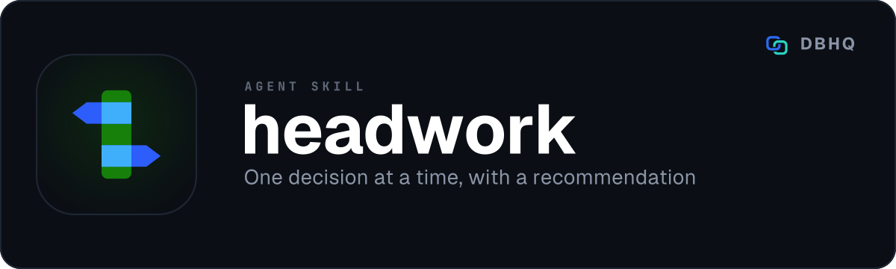

<div align="center">



# headwork

**One decision at a time, with a recommendation**

[](LICENSE)
[](https://code.claude.com/docs/en/plugins)
[]()

A free, open-source tool by [DBHQ](https://dbhq.uk) - documented at [skills.dbhq.uk](https://skills.dbhq.uk/headwork/)

</div>

---

The decision blocking you right now, explained in plain English and put as a
single question whose options each carry their justification, with one named as
the recommendation and a clause saying what would overturn it.

## What makes it different

**An even-handed list of options is a decision handed back.** Most agents, asked
to help you decide, produce a menu: four labels, no argument, and the work of
weighing them still entirely yours. headwork always picks one, gives the reason,
and then - the part that matters - says what would make a different option
right.

> **RECOMMENDED.** REASON: the purge step is four lines calling one documented endpoint, and one push tells you in ninety seconds what an hour of local proving would.
> **OVERTURNED IF:** a failed purge would serve stale files to real traffic rather than to you.

That last clause is deliberate. A recommendation with no stated escape is an
anchor, and anchoring is hard to argue with by design. Naming the condition
hands you the criterion instead of just the verdict, so overruling it is a
matter of checking a fact you know and the agent does not.

The second rule is what stops the questions being worthless:

> **Never ask what you can find out.**

Before every question it looks - the session, `git log`, the file, the open
issues, the register - and states in one line what it checked. A question a file
could have answered is a bug, not a style lapse. The best round headwork runs is
the one where looking removes the decision entirely, and it tells you that
rather than building a well-formatted box around a question nobody needed.

It also refuses on cost. A question spends your attention, so a cheap, easily
reversed choice gets made and stated rather than asked - being unable to look
something up does not make it worth interrupting you for.

## What a round looks like

1. **Look** - session first, then whatever the decision touches.
2. **Say what you checked**, in one line, including anything it already settles.
3. **Explain in bite-sized chunks** - two to four short points, plain English.
4. **Ask one question** - two to four options, the recommendation named first
   with what would overturn it, every option carrying its justification and
   every alternative its cost.
5. **Stop and wait.** No second question, no trailing "and also".
6. **Hand the answer back** to the session, which does the work.

Then it goes again, for **as many rounds as it takes to unblock you**. There is
no cap. What is capped is questions per message: one, then silence. Four
questions in one message is a form, and what comes back is whatever was easiest
to answer rather than what mattered.

## What it will not do

- **headwork never goes looking for work.** No backlog sweep, no stalled-item
  hunt, no scheduled triage. You bring the thing you are stuck on, or it asks
  what you are working on.
- **headwork never edits anything.** It decides; the session does the work with
  the tools it already has.
- **headwork keeps no state.** No log, no files, no directory of its own. The
  reasoning belongs in what the answer produces - the commit message, the pull
  request body, or the register the repo already keeps.

## If you are choosing between this and grill-me

[`grill-me`](https://github.com/RobMitt/grill-me-skill) got there first and is
better known, and it is the honest comparison to draw. It also already asks one
question at a time, gives two to four options, and explores the codebase rather
than asking what it could read - so treat those three as table stakes for this
kind of skill rather than as anyone's selling point.

The difference is what each is **for**:

- **`grill-me` interviews you** - relentlessly, down every branch of a design
  tree, until you and it share an understanding of the whole plan. Its options
  are the likely answers, and choosing between them is your job. Reach for it
  when you have a design to stress-test and time to be taken apart.
- **`headwork` unblocks you** - it takes whatever is stopping the session right
  now and argues for an answer. Every question names a recommendation and the
  condition that would overturn it. Reach for it when you are stuck mid-task and
  want a considered opinion rather than a thorough examination.

They are not substitutes and there is no reason to pick only one.

## Install

### As a Claude Code plugin (recommended)

```
/plugin marketplace add dbhq-uk/marketplace
/plugin install headwork@dbhq
```

### Any agent (Cursor, Copilot, Windsurf, Gemini, Cline and more)

```bash
npx skills add dbhq-uk/headwork-skill
```

### From source

```bash
git clone https://github.com/dbhq-uk/headwork-skill.git
cd headwork-skill
./install.sh          # Claude Code
./install-codex.sh    # Codex
```

Nothing to configure. No dependencies, no credentials, no state directory.

## Codex and other harnesses

The question box is a Claude Code tool. Codex has none, so headwork ships a
**specified** text fallback rather than an improvised one - the same six parts
in a fixed block, one question per turn, then stop and wait. The two paths are
held in step by test, so the Codex side cannot quietly rot into prose.

## Using it

It fires on its own when you say you are stuck, ask what comes next, or ask to
be unblocked. You can also call it directly:

```
/headwork
```

There is nothing to pass it. It reads what the session is already working on.

## Also from DBHQ

Sixteen free agent skills, all of them installable from the same marketplace and
all documented at **[skills.dbhq.uk](https://skills.dbhq.uk)**. The marketplace
itself is [dbhq-uk/marketplace](https://github.com/dbhq-uk/marketplace) - one
`/plugin marketplace add` and every one of them is available.

Five of them share the `-work` suffix because they share a shape - each does one
part of getting work done, and none needs the others. `legwork` researches,
**headwork** decides, `deskwork` tracks and orders, `buildwork` executes, and
`groupwork` puts a second agent on any of it.

| Skill | What it does |
|---|---|
| [outlook](https://skills.dbhq.uk/outlook/) | Microsoft 365 mail and calendar, from the terminal |
| [trello](https://skills.dbhq.uk/trello/) | Your boards, run from your agent |
| [legwork](https://skills.dbhq.uk/legwork/) | Research that settles a decision, and says when it cannot |
| [dovetail](https://skills.dbhq.uk/dovetail/) | Checks whether your repository still agrees with itself |
| [verve](https://skills.dbhq.uk/verve/) | Strips AI tells from prose and puts a voice back |
| [vela](https://skills.dbhq.uk/vela/) | Compiler-exact code search, in any language you index |
| [garmin](https://skills.dbhq.uk/garmin/) | Your Garmin data, answered in the terminal |
| [imager](https://skills.dbhq.uk/imager/) | Images from GPT Image 2, costed before it spends |
| [gitview](https://skills.dbhq.uk/gitview/) | Which branches are finished, and safe to delete |
| [atlassian](https://skills.dbhq.uk/atlassian/) | Jira issues and Confluence pages |
| [pennyblack](https://skills.dbhq.uk/pennyblack/) | A physical letter, posted from the terminal |
| [buildwork](https://skills.dbhq.uk/buildwork/) | Your open issues, run as parallel agents |
| [deskwork](https://skills.dbhq.uk/deskwork/) | What an agent noticed, tracked as real work |
| [groupwork](https://skills.dbhq.uk/groupwork/) | A second agent on the work, and a result you can cite |

Plus [heliograph](https://skills.dbhq.uk/heliograph/), for a machine you cannot log into.

## Contributing

Issues and pull requests welcome - see [`CONTRIBUTING.md`](CONTRIBUTING.md), and
read [`AGENTS.md`](AGENTS.md) first for the rules this skill does not break.

## Licence

MIT - see [`LICENSE`](LICENSE).
